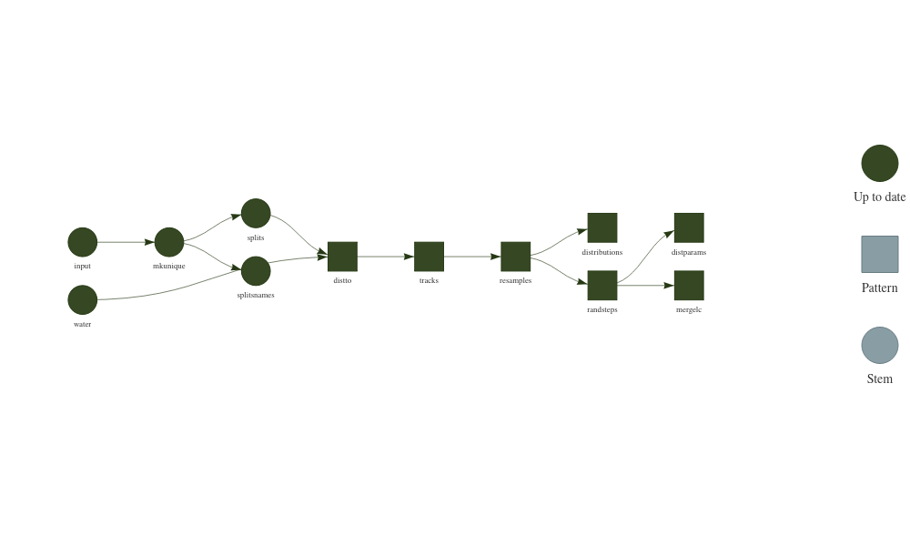

# `targets` workflow for iSSA with `amt`

<!-- -->

## R setup

``` r
options(repos = c(
    ropensci = 'https://ropensci.r-universe.dev',
    tidyverse = 'https://tidyverse.r-universe.dev',
    rspatial = 'https://rspatial.r-universe.dev',
    CRAN = 'https://cloud.r-project.org'))

install.packages(c('data.table', 'amt', 'sf', 'ggplot2', 'raster', 'qs', 'terra' ))
```

## Data setup

Run through `scripts/prep-fisher.R`.

## Run the workflow

``` r
library(targets)
tar_make()
```

    ## 
    ## Attaching package: ‘amt’
    ## 
    ## The following object is masked from ‘package:stats’:
    ## 
    ##     filter
    ## 
    ## Linking to GEOS 3.9.1, GDAL 3.2.3, PROJ 8.0.1
    ## Loading required package: sp
    ## 
    ## Attaching package: ‘sp’
    ## 
    ## The following object is masked from ‘package:amt’:
    ## 
    ##     bbox
    ## 
    ## 
    ## Attaching package: ‘raster’
    ## 
    ## The following object is masked from ‘package:data.table’:
    ## 
    ##     shift
    ## 
    ## The following object is masked from ‘package:amt’:
    ## 
    ##     select
    ## 
    ## ✓ skip target input
    ## ✓ skip target water
    ## ✓ skip target mkunique
    ## ✓ skip target splits
    ## ✓ skip target splitsnames
    ## ✓ skip branch distto_af8a91a7
    ## ✓ skip branch distto_cce14954
    ## ✓ skip branch distto_6f2dc808
    ## ✓ skip branch distto_f20c9ae9
    ## ✓ skip branch tracks_23ed6a8f
    ## ✓ skip branch tracks_51b5c2be
    ## ✓ skip branch tracks_0253d4f4
    ## ✓ skip branch tracks_44e98671
    ## ✓ skip branch resamples_cf979759
    ## ✓ skip branch resamples_e9f3484e
    ## ✓ skip branch resamples_9ee98d7e
    ## ✓ skip branch resamples_42114480
    ## ✓ skip branch randsteps_debdfa2c
    ## ✓ skip branch randsteps_6ccf3d63
    ## ✓ skip branch randsteps_64c94963
    ## ✓ skip branch randsteps_969ae60f
    ## ✓ skip branch distributions_debdfa2c
    ## ✓ skip branch distributions_6ccf3d63
    ## ✓ skip branch distributions_64c94963
    ## ✓ skip branch distributions_969ae60f
    ## ✓ skip branch mergelc_70311396
    ## ✓ skip branch mergelc_7951511d
    ## ✓ skip branch mergelc_0e7b9882
    ## ✓ skip branch mergelc_51685024
    ## ✓ skip branch distparams_70311396
    ## ✓ skip branch distparams_7951511d
    ## ✓ skip branch distparams_0e7b9882
    ## ✓ skip branch distparams_51685024
    ## ✓ skip pipeline

## Explore results

See `scripts/explore-results.R` for a full example.

Below is an example of how to interact with `targets` outputs - but
don’t run them in this README. Copy over to a separate R script or check
out the explore results script.

``` r
library(targets)

## Run the full workflow
tar_make()

## Inspect output with tar_read or tar_load
# *Read* one branch (individual in this case)
tar_read(tracks, 1)
tar_read(tracks, 2)

# Or all combined
tar_read(tracks)

# Plot all distributions
tar_read(distributions)

# *Load* all random steps
tar_load(randsteps)
```
