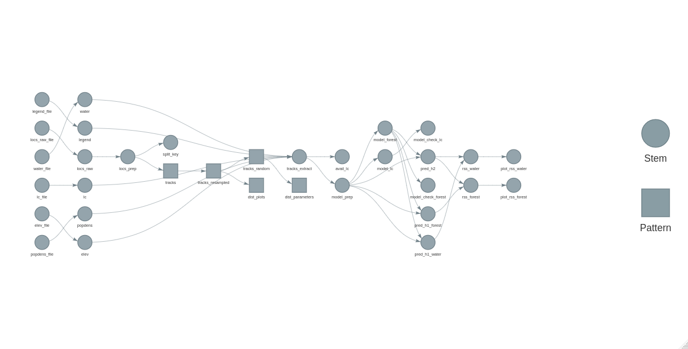

# targets-iSSA

[](https://doi.org/10.5281/zenodo.6423519)



## Setup

``` r
renv::restore()
```

## Run the workflow

``` r
library(targets)
tar_make()
```

## Resources

How-To iSSA: <https://issa-guild.github.io/book/>,
<https://github.com/iSSA-guild/book>
